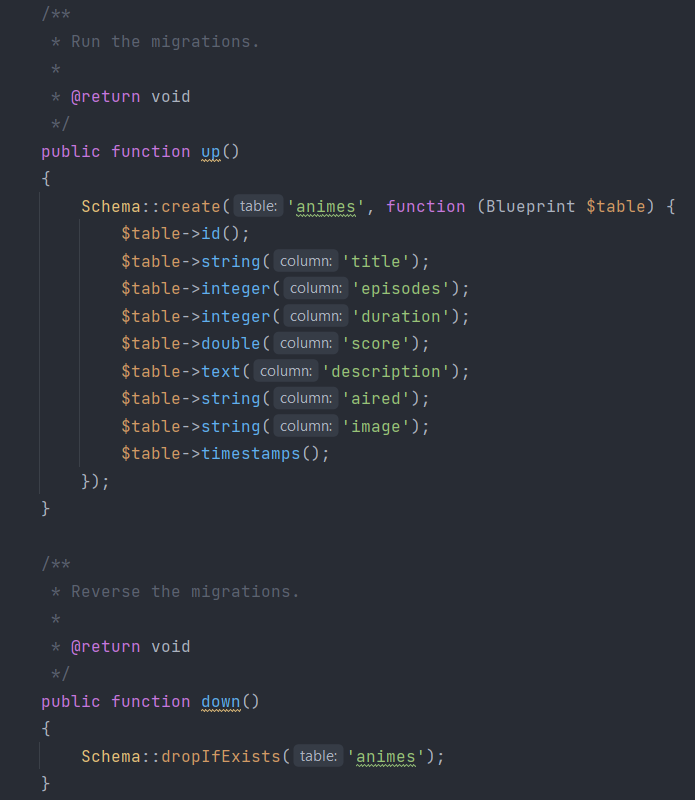
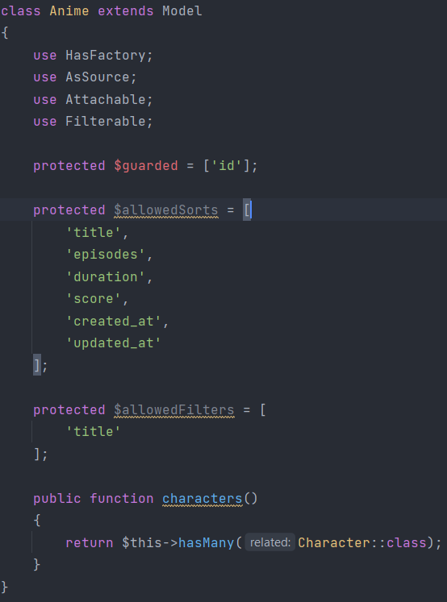
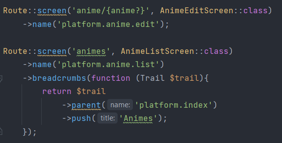
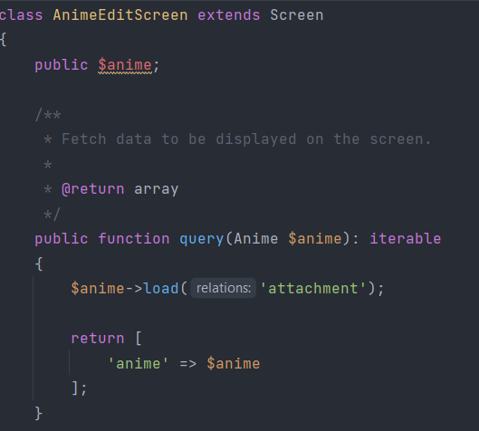
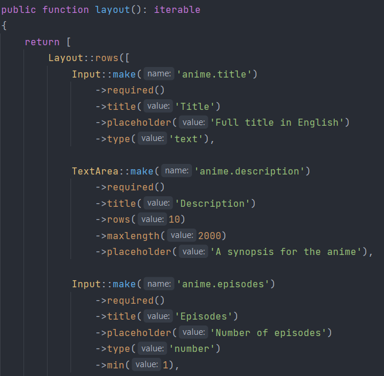
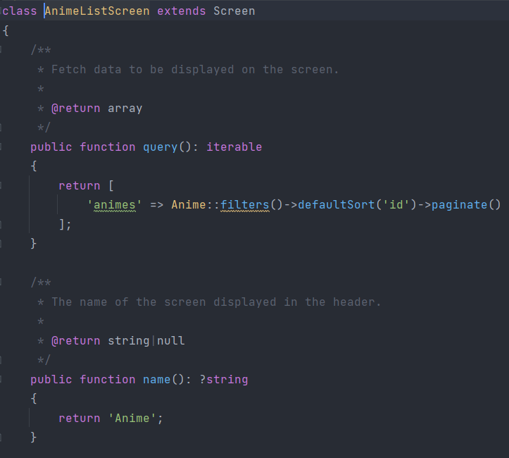
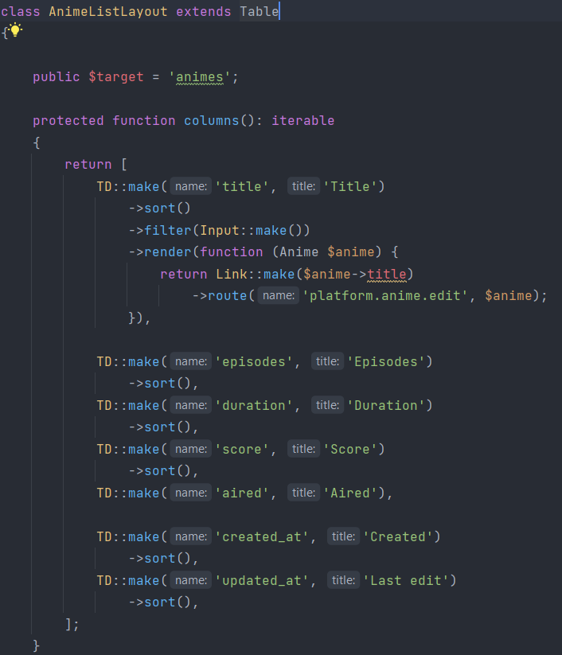
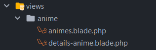
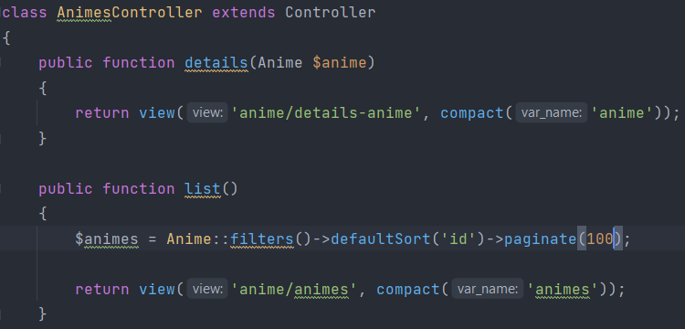
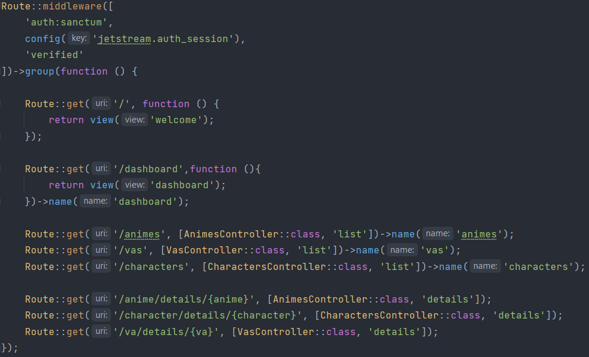

# About
This project a management system for animes vaguely similar to sites like [AniList.co](https://anilist.co/) and is built with the [Laravel](https://laravel.com/) framework.

The project is licensed under the MIT license.

- [Code](#code)
	- [Models](#models)
	- [Routes](#routes)
	- [Screens](#screens)
		- [Edit Screen](#edit-screen)
		- [List Screen](#list-screen)
	- [Public Section](#public-section)
- [Setup](#setup)
	- [Requirements](#requirements)
	- [Download](#download)
	- [Environment Configutation](#environment-configuration)
	- [Run the project](#run-the-project)

# Code
This project was largely built using [Laravel Jetstream Livewire](https://jetstream.laravel.com/2.x/stacks/livewire.html) for the authentication and authorization of users and [Laravel Orchid](https://orchid.software/) for the admin panel and CRUD operations.

## Models
For each model we want to create we must first create a migration for the corresponding table in out DB.



After which we have to create a model class.



## Routes
Using Laravel Orchid we definite routes for the screens (instead of views) within `routes/platform.php`.



## Screens
Screens are a feature of Orchid that define the page layout and the components that need to be displayed. They are however different from views in that there is no actual HTML or CSS contained within them, only code that describes how the page should look. They are located in `app/Orchid/Screens`.

We only use screen for the admin panel and not for the publicly visible part of the site where we use regular views.

### Edit Screen
The Edit Screen, despite its name, is used for way more than just editing existing models. With it we can create, edit, and delete entries with only the read operation being left to the corresponding List Screen.





### List Screen
For the read operation we create a List Screen which allows us to easily see all the records within our DB and selectively edit or delete any of them.



We additionally definite the layout for the List Screen in a separate file. This layout allows us to filter or sort the results we get by a given field. Layouts are located in `app/Orchid/Layouts`.



## Public Section
For the pages that are not part of the admin panel we use standard controllers, views, and routing.
- views are contained in `resources/views`
- controllers are contained in `app/Http/Controllers`
- routing is done in the file `routes/web.php`

For each model we have a "list" view for displaying all records to the user and a "details" view for displaying all the information for a single entry.



The views are returned by controllers and are also supplied by them with the necessary data that they need to display.



We then map the controller actions to the appropriate route and with appropriate middleware.


# Setup

## Requirements
The project requires the following to work:
- php 8
- composer
- Laravel 9
- npm
## Download
You can clone the git repository using the following command:
```
git clone https://github.com/OppaiSenpai5/LaravelProject
```

## Environment Configuration
Create `.env` file using the `.env.example` file provided.

## Run the project
In order to run the project you'll need to run the following commands in the project folder first:
```
composer update
composer install
npm install
php artisan key:generate
php artisan storage:link
php artisan migrate --seed
npm run build
php artisan serve
```
